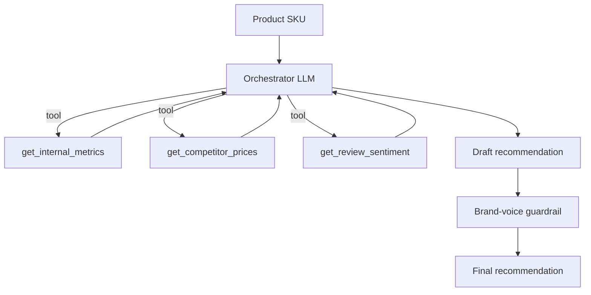

# Weeks 7-9 Detailed Walkthrough: Agents (The Differentiator)

**For Rob Snyder. Working tutorial, not just a plan. This is the centerpiece of the entire 90-day plan. By the end of Week 9 you have: a production-shaped Commerce AI Ops Agent (built two ways), a published MCP server in a near-empty niche (Drupal + MCP), and the single most marketable skill in the 2026 AI engineer job market.**

**Why this phase matters most**: RAG is now table-stakes. Every junior AI engineer can build one. Agents - tool use, orchestration, multi-step reasoning, MCP - are the premium skill that separates "AI engineer" from "I built a chatbot." This is where your interviews will go and where your portfolio earns its keep. Spend the time.

These are three weeks (21 working days). The pacing is heavier than earlier phases. Week 7 builds the agent from raw API. Week 8 reimplements it in LangGraph and adds a second framework for vocabulary. Week 9 builds and publishes the MCP server.

---

## Before You Start: Prerequisites Check (15 minutes)

Coming into Week 7 you should have, from Weeks 1-6:

- [ ] `cert-rag-cli` repo (SQF compliance RAG) with vanilla/hybrid/rerank retrievers, clause-citation + refusal eval harness, Langfuse, and three implementations (raw/LCEL/LangGraph)
- [ ] One LoRA adapter on Hugging Face
- [ ] Comfort with: raw Anthropic tool-use loop (Week 1 Day 4), LCEL, basic LangGraph (Week 5 Day 5)
- [ ] Langfuse running locally or in the cloud
- [ ] All API keys loaded

### Install new dependencies

You'll create a fresh repo for the agent rather than crowding the RAG repo.

```bash
cd ~/projects
mkdir commerce-ai-ops-agent
cd commerce-ai-ops-agent
uv init --python 3.12
uv add anthropic langgraph langchain langchain-anthropic langfuse rich pydantic httpx
git init
echo "__pycache__/" > .gitignore
echo ".env" >> .gitignore
echo "*.pyc" >> .gitignore
```

Create the GitHub repo `commerce-ai-ops-agent` (personal account, `rsnyd`), set the remote with your `-personal` SSH alias, and set the per-repo commit email as you configured in the dual-account setup:

```bash
git remote add origin git@github.com-personal:rsnyd/commerce-ai-ops-agent.git
git config user.email "<your rsnyd noreply email>"
```

---

# WEEK 7: The Commerce AI Ops Agent (Raw API)

**Goal**: Build a real, multi-tool agent from raw Anthropic SDK so you understand every part of the orchestration. By Sunday it ingests a product SKU, calls three tools, applies a brand-voice guardrail, traces every call, and is evaluated against a reference set.

---

## Day 1 (Mon): Agent Patterns (Read First, Code Tomorrow)

The most important reading day of the plan. Do not skip it to start coding.

### Concept: What an agent actually is

An agent is an LLM in a loop with tools and a goal. That's it. The LLM decides what to do, your code executes tools and feeds results back, and the loop continues until the goal is met. You built the simplest version of this in Week 1 Day 4 (the weather tool). An agent is that loop, generalized: more tools, a clearer goal, and decision logic about when to stop.

The hype around agents obscures how simple the core is. Strip away the frameworks and an agent is: a system prompt defining the goal, a set of tools, and a loop that runs until the model says it's done. Everything else (orchestration, memory, planning) is patterns layered on that core.

### Concept: The seven patterns (memorize these by name)

From Anthropic's "Building Effective Agents," the canonical taxonomy. You should be able to name and describe each in an interview:

1. **Augmented LLM** - a single model call enhanced with retrieval, tools, and memory. The building block.
2. **Prompt chaining** - decompose a task into a fixed sequence of steps, each a separate LLM call. Use when the task has clear sequential subtasks.
3. **Routing** - classify the input, then route to a specialized handler. Use when inputs fall into distinct categories needing different handling.
4. **Parallelization** - run multiple LLM calls simultaneously, either splitting subtasks (sectioning) or running the same task for votes (voting). Use for speed or for aggregating multiple perspectives.
5. **Orchestrator-workers** - a central LLM dynamically breaks down a task, delegates to worker LLMs, and synthesizes their results. Use when subtasks can't be predicted in advance. **This is the pattern for our Commerce agent.**
6. **Evaluator-optimizer** - one LLM generates, another critiques, loop until the critique passes. Use when you have clear evaluation criteria and iteration helps. (Your Week 5 LangGraph grade-and-rewrite was a simple version of this.)
7. **Autonomous agent** - the model plans and acts in an open-ended loop, using tools and environment feedback, until it decides the task is complete. The most powerful and least predictable. Use when the path can't be predetermined and you can tolerate the unpredictability.

The key engineering judgment, which Anthropic stresses and interviewers probe: **use the simplest pattern that works.** Don't build an autonomous agent when prompt chaining solves it. More autonomy means more cost, more latency, and less predictability. Reaching for the simplest sufficient pattern signals senior judgment.

### Reading (2 hours, with notes)

- Anthropic, "Building Effective Agents": https://www.anthropic.com/research/building-effective-agents - read carefully, take notes on each pattern
- Anthropic Cookbook agents patterns (clone and skim the code): https://github.com/anthropics/anthropic-cookbook/tree/main/patterns/agents
- OpenAI, "A Practical Guide to Building Agents" (PDF): https://cdn.openai.com/business-guides-and-resources/a-practical-guide-to-building-agents.pdf - know both vocabularies

### Whiteboard exercise (30 min, on paper)

Design the Commerce AI Ops Agent on paper before writing code. Draw:

- The goal: SKU in, merchandising recommendation out
- The three tools and what each returns
- The orchestrator-workers shape
- Where the brand-voice guardrail sits
- Where the loop can end

Keep this drawing. You'll implement exactly it this week.

No commit today; reading and design.

---

## Day 2 (Tue): Build the Three Tools (Standalone First)

### Concept: Tools are just functions

Before wiring anything to an LLM, build each tool as a plain Python function that works on its own. This is the discipline that keeps agents debuggable: if a tool is broken, you find out before the LLM is involved. An agent that calls broken tools produces confident nonsense.

Our three tools:

1. `get_competitor_prices(product_name)` - web search for competitor pricing
2. `get_internal_metrics(sku)` - your Commerce inventory and sales history
3. `get_review_sentiment(sku)` - review sentiment for the product

For learning, tools 2 and 3 use mock data (a JSON file standing in for your real Drupal Commerce API and Yotpo). Tool 1 uses real web search. In a real deployment you'd point 2 and 3 at live endpoints; the agent logic is identical.

### Project: `tools.py`

```python
"""Week 7 Day 2: The three tools, each working standalone."""
import json
from pathlib import Path

import httpx
from anthropic import Anthropic

# Mock internal data standing in for Drupal Commerce + Yotpo.
# In production these would be live API calls.
MOCK_DATA = Path("mock_data.json")


def _load_mock() -> dict:
    if not MOCK_DATA.exists():
        # Seed with a couple of example SKUs
        seed = {
            "GM-001": {
                "name": "Garam Masala",
                "inventory": 42,
                "units_sold_30d": 137,
                "avg_daily_sales": 4.6,
                "current_price": 8.99,
                "reorder_point": 30,
                "reviews": [
                    {"rating": 5, "text": "Best garam masala I've found. Fresh and aromatic."},
                    {"rating": 4, "text": "Good but the jar arrived half full once."},
                    {"rating": 5, "text": "Use it weekly. Warm and balanced."},
                ],
            },
            "BB-002": {
                "name": "Berbere",
                "inventory": 12,
                "units_sold_30d": 88,
                "avg_daily_sales": 2.9,
                "current_price": 9.49,
                "reorder_point": 20,
                "reviews": [
                    {"rating": 5, "text": "Authentic heat, complex. Great for doro wat."},
                    {"rating": 3, "text": "Hotter than expected."},
                ],
            },
        }
        MOCK_DATA.write_text(json.dumps(seed, indent=2))
    return json.loads(MOCK_DATA.read_text())


def get_internal_metrics(sku: str) -> dict:
    """Return inventory, sales velocity, price, and reorder point for a SKU."""
    data = _load_mock()
    if sku not in data:
        return {"error": f"SKU {sku} not found"}
    d = data[sku]
    return {
        "sku": sku,
        "name": d["name"],
        "inventory": d["inventory"],
        "units_sold_30d": d["units_sold_30d"],
        "avg_daily_sales": d["avg_daily_sales"],
        "current_price": d["current_price"],
        "reorder_point": d["reorder_point"],
        "days_of_stock_left": round(d["inventory"] / d["avg_daily_sales"], 1),
    }


def get_review_sentiment(sku: str) -> dict:
    """Summarize review sentiment for a SKU using an LLM over the review text."""
    data = _load_mock()
    if sku not in data:
        return {"error": f"SKU {sku} not found"}
    reviews = data[sku]["reviews"]
    avg_rating = sum(r["rating"] for r in reviews) / len(reviews)

    # Use a cheap model to summarize sentiment themes
    client = Anthropic()
    review_text = "\n".join(f"[{r['rating']}/5] {r['text']}" for r in reviews)
    resp = client.messages.create(
        model="claude-haiku-4-5",
        max_tokens=256,
        messages=[{
            "role": "user",
            "content": f"Summarize the key themes (positive and negative) in these product reviews in 2 sentences:\n\n{review_text}"
        }],
    )
    return {
        "sku": sku,
        "avg_rating": round(avg_rating, 2),
        "review_count": len(reviews),
        "sentiment_summary": resp.content[0].text.strip(),
    }


def get_competitor_prices(product_name: str) -> dict:
    """Search the web for competitor prices for a product type.

    For learning, this is a simplified mock that returns plausible numbers.
    In production, wire this to a real web search API (Brave, Serper, Tavily).
    """
    # Mock competitor data keyed by product type
    mock_competitors = {
        "Garam Masala": [
            {"vendor": "CompetitorA", "price": 7.49, "size": "2oz"},
            {"vendor": "CompetitorB", "price": 9.99, "size": "2.5oz"},
            {"vendor": "CompetitorC", "price": 6.99, "size": "1.8oz"},
        ],
        "Berbere": [
            {"vendor": "CompetitorA", "price": 8.99, "size": "2oz"},
            {"vendor": "CompetitorB", "price": 11.49, "size": "3oz"},
        ],
    }
    competitors = mock_competitors.get(product_name, [])
    if not competitors:
        return {"product_name": product_name, "competitors": [], "note": "No competitor data found"}
    prices = [c["price"] for c in competitors]
    return {
        "product_name": product_name,
        "competitors": competitors,
        "avg_competitor_price": round(sum(prices) / len(prices), 2),
        "min_competitor_price": min(prices),
        "max_competitor_price": max(prices),
    }


if __name__ == "__main__":
    # Test each tool standalone
    print("=== Internal metrics ===")
    print(json.dumps(get_internal_metrics("GM-001"), indent=2))
    print("\n=== Review sentiment ===")
    print(json.dumps(get_review_sentiment("GM-001"), indent=2))
    print("\n=== Competitor prices ===")
    print(json.dumps(get_competitor_prices("Garam Masala"), indent=2))
```

Run it:

```bash
uv run python tools.py
```

Verify each tool returns sensible data. This is the foundation; if the tools are flaky the agent is flaky.

A note on `get_competitor_prices`: I've mocked it so you're not blocked on a web search API key. When you want real data, swap the body for a call to Tavily, Serper, or Brave Search (all have free tiers and clean Python clients). The agent doesn't care; it just calls the function.

Commit:

```bash
git add tools.py mock_data.json
git commit -m "Day 2 (wk7): three tools working standalone (metrics, sentiment, competitor prices)"
```

---

## Day 3 (Wed): Define Tool Schemas and the Agent Loop

### Concept: From function to tool schema

The LLM doesn't see your Python function. It sees a JSON schema describing the tool's name, purpose, and parameters. You write that schema (you did this in Week 1). The model uses the description to decide when to call the tool and how to fill the arguments. Good descriptions matter enormously: a vague description means the model misuses the tool.

### Project: `agent.py` (the orchestrator loop)

```python
"""Week 7 Day 3: The Commerce AI Ops Agent - raw Anthropic SDK orchestration."""
import json

from anthropic import Anthropic

import tools

MODEL = "claude-sonnet-4-6"

# Tool schemas the model sees
TOOL_SCHEMAS = [
    {
        "name": "get_internal_metrics",
        "description": "Get current inventory, 30-day sales velocity, current price, reorder point, and days of stock remaining for a product SKU. Call this first to understand the product's current state.",
        "input_schema": {
            "type": "object",
            "properties": {"sku": {"type": "string", "description": "Product SKU, e.g. 'GM-001'"}},
            "required": ["sku"],
        },
    },
    {
        "name": "get_competitor_prices",
        "description": "Search for competitor prices for a product by its name (not SKU). Returns competitor list with prices and the average/min/max. Use the product name from get_internal_metrics.",
        "input_schema": {
            "type": "object",
            "properties": {"product_name": {"type": "string", "description": "Product name, e.g. 'Garam Masala'"}},
            "required": ["product_name"],
        },
    },
    {
        "name": "get_review_sentiment",
        "description": "Get average rating, review count, and a sentiment summary for a product SKU. Use to factor customer perception into the recommendation.",
        "input_schema": {
            "type": "object",
            "properties": {"sku": {"type": "string", "description": "Product SKU, e.g. 'GM-001'"}},
            "required": ["sku"],
        },
    },
]

# Map tool names to the actual functions
TOOL_FUNCTIONS = {
    "get_internal_metrics": tools.get_internal_metrics,
    "get_competitor_prices": tools.get_competitor_prices,
    "get_review_sentiment": tools.get_review_sentiment,
}

SYSTEM_PROMPT = """You are a merchandising analyst for Spices Inc, a small-batch spice company.

Given a product SKU, produce a concise merchandising recommendation covering:
1. Pricing: is the current price competitive? Should it change?
2. Inventory: is a reorder needed soon?
3. Promotional angle: a one-line suggestion grounded in reviews and positioning.

Use the available tools to gather data before recommending. Call get_internal_metrics
first to learn the product name and state, then gather competitor and review data as needed.

Base every claim on tool data. Do not invent numbers. Keep the final recommendation under
150 words. Use plain hyphens, never em dashes."""


def run_agent(sku: str, max_turns: int = 8) -> str:
    client = Anthropic()
    messages = [{"role": "user", "content": f"Produce a merchandising recommendation for SKU {sku}."}]

    for turn in range(max_turns):
        response = client.messages.create(
            model=MODEL,
            max_tokens=1500,
            system=SYSTEM_PROMPT,
            tools=TOOL_SCHEMAS,
            messages=messages,
        )

        if response.stop_reason == "end_turn":
            # Final answer
            return response.content[0].text

        if response.stop_reason == "tool_use":
            # Append the assistant's turn (with tool_use blocks)
            messages.append({"role": "assistant", "content": response.content})

            # Execute every tool the model requested this turn
            tool_results = []
            for block in response.content:
                if block.type == "tool_use":
                    fn = TOOL_FUNCTIONS[block.name]
                    print(f"  -> {block.name}({block.input})")
                    result = fn(**block.input)
                    tool_results.append({
                        "type": "tool_result",
                        "tool_use_id": block.id,
                        "content": json.dumps(result),
                    })

            messages.append({"role": "user", "content": tool_results})

    return "Agent stopped: max turns reached without a final recommendation."


if __name__ == "__main__":
    import sys
    sku = sys.argv[1] if len(sys.argv) > 1 else "GM-001"
    print(f"Running agent for {sku}...\n")
    recommendation = run_agent(sku)
    print(f"\n=== Recommendation ===\n{recommendation}")
```

Run it:

```bash
uv run python agent.py GM-001
```

Watch the tool-call trace. The model should call `get_internal_metrics` first (learning the name is "Garam Masala"), then `get_competitor_prices` with that name, then `get_review_sentiment`, then produce a recommendation. That sequence - where the output of one tool feeds the input of the next - is the orchestrator at work.

Try the other SKU:

```bash
uv run python agent.py BB-002
```

Notice `BB-002` (Berbere) has inventory 12 with a reorder point of 20 - the agent should flag a reorder. That's the agent reasoning over tool data, not just summarizing it.

Commit:

```bash
git add agent.py
git commit -m "Day 3 (wk7): orchestrator-workers agent loop, three tools wired in"
```

---

## Day 4 (Thu): Add the Brand-Voice Guardrail

### Concept: Guardrails as a second model call

A guardrail is a check applied to the model's output before it's returned. The simplest effective pattern: a second LLM call that evaluates the first's output against rules and either approves it or sends it back for revision. This is the evaluator-optimizer pattern from Day 1, applied as a safety/quality gate.

For our agent, the guardrail checks that the recommendation's promotional language matches Spices Inc brand voice (no forbidden words, hyphens not em dashes, concrete not hype).

### Concept: Don't ask the model to do a regex's job

Read the brand rules below and notice that they are not all the same kind of rule. "No forbidden words" and "plain hyphens, never em dashes" are exact string matches - a scan either finds the character or it doesn't. "Concrete before evocative" and "specific about heat, not vague" are judgment calls that no regex will ever make.

Hand the exact-match rules to the model anyway and you get the worst of both. Asked to check dashes, Sonnet flagged plain hyphens as em dashes, then argued with itself inside the output:

```
"Em dash used instead of a plain hyphen ('justified - hold' uses a plain hyphen
correctly, but... re-examining: the Pricing section uses ' - ' which are plain
hyphens, so this is acceptable)."
```

It also reported the same forbidden word once per occurrence, so a draft using "premium" twice produced two identical violations. That list is what you print to the console and read in Langfuse - it has to stay scannable.

So split the work by what each half is actually good at: a string scan owns the mechanical rules and is never wrong about them; the model owns the judgment calls and is told not to touch the mechanical ones. The scan's findings are passed into the prompt so the revision still fixes everything in one pass. This is worth doing deliberately - "use the LLM for the part that needs judgment, and ordinary code for the part that doesn't" is the single most transferable lesson in this week.

### Project: Add `guardrail.py` and wire it in

```python
"""Week 7 Day 4: Brand-voice guardrail as an evaluator-optimizer gate."""
import re

from anthropic import Anthropic

BRAND_RULES = """Spices Inc brand voice:
- Warm, expert, never patronizing. Concrete before evocative.
- Forbidden words: elevate, premium, artisanal, gourmet, curated, luxurious, decadent.
- Preferred: well-made, carefully sourced, small batch, honest, fresh-ground.
- Plain hyphens, never em dashes. Specific about heat (mild, building, sharp), not vague."""

# Stems, not whole words, so "elevated" and "curating" are caught too.
FORBIDDEN_STEMS = ["elevat", "premium", "artisanal", "gourmet", "curat", "luxurious", "decadent"]
DASHES = {"—": "em dash", "–": "en dash"}


def scan_exact_rules(text: str) -> list[str]:
    """Check the rules that are pure string matching. One entry per distinct violation."""
    violations = []
    for stem in FORBIDDEN_STEMS:
        match = re.search(rf"\b{stem}\w*", text, re.IGNORECASE)
        if match:
            violations.append(f'forbidden word: "{match.group()}"')
    for char, name in DASHES.items():
        if char in text:
            violations.append(f'{name} instead of plain hyphen: "{char}"')
    return violations


REPORTING_RULES = """How to report:
- Dashes and forbidden words are already checked in code. Never report those - just fix
  every occurrence of the ones listed below in your revised text.
- Report only judgment calls: patronizing or hype tone, evocative language that arrives
  before anything concrete, vague sensory description where a specific one belongs.
- One entry per distinct phrase. If two rules describe the same phrase, report it once
  under the rule that fits best.
- Format each entry as `rule broken: "exact quote"`, 15 words max. The entry ends at the
  closing quote - never append an explanation of why it is wrong.
- Only report what you can quote verbatim. If you cannot quote it, it is not a violation.
- No reasoning, hedging, or self-correction in an entry. Decide first, then report.
- Judge the text only against the rules above, as they apply to what the text actually
  says. Do not require content the text was never meant to include.
- If nothing breaks a rule, return an empty list."""

CHECK_TOOL = {
    "name": "report_check",
    "description": "Report brand-voice judgment violations and return the corrected text.",
    "input_schema": {
        "type": "object",
        "properties": {
            "violations": {
                "type": "array",
                "maxItems": 4,
                "items": {
                    "type": "string",
                    "description": 'One distinct judgment violation as `rule broken: "exact quote"`, 15 words max. No reasoning.',
                },
            },
            "revised_text": {"type": "string", "description": "The full text with every violation fixed, keeping the original sections and structure. If nothing needs fixing, echo the original exactly."},
        },
        "required": ["violations", "revised_text"],
    },
}


def apply_brand_guardrail(text: str) -> dict:
    exact_violations = scan_exact_rules(text)
    found = "\n".join(f"- {v}" for v in exact_violations) or "- none"

    client = Anthropic()
    resp = client.messages.create(
        model="claude-sonnet-4-6",
        max_tokens=1024,
        system=f"You check text against brand-voice rules and fix violations.\n\n{BRAND_RULES}\n\n{REPORTING_RULES}",
        tools=[CHECK_TOOL],
        tool_choice={"type": "tool", "name": "report_check"},
        messages=[{"role": "user", "content": f"A code scan already found these violations to fix:\n{found}\n\nCheck this recommendation:\n\n{text}"}],
    )
    for block in resp.content:
        if block.type == "tool_use":
            result = block.input
            violations = exact_violations + result["violations"]
            return {
                "passes": not violations,
                "violations": violations,
                "revised_text": result["revised_text"],
            }
    # tool_choice forces the tool, so this is unreachable in practice - but callers index
    # into the result, so fail open with the original text rather than returning None.
    return {"passes": not exact_violations, "violations": exact_violations, "revised_text": text}
```

Two details worth copying into your own guardrails. `passes` is now derived (`not violations`) rather than something the model asserts separately - the model could previously return `passes: true` alongside a non-empty violations list, and callers branch on that flag. And the `maxItems: 4` cap plus the 15-word limit in the item description do real work: schema descriptions are instructions the model follows, not documentation for you.

Wire it into `agent.py`:

```python
# At the top of agent.py
from guardrail import apply_brand_guardrail

# Change run_agent to apply the guardrail before returning
def run_agent(sku: str, max_turns: int = 8) -> str:
    # ... existing loop ...
        if response.stop_reason == "end_turn":
            raw = response.content[0].text
            check = apply_brand_guardrail(raw)
            if not check["passes"]:
                print(f"  [guardrail] violations: {check['violations']}")
            return check["revised_text"]  # always return the (possibly revised) text
    # ... rest unchanged ...
```

Test the scan first - it is ordinary code, so test it like ordinary code:

```python
from guardrail import scan_exact_rules

assert scan_exact_rules("**Pricing** - hold at $8.99") == []          # plain hyphens are fine
assert scan_exact_rules("justified — hold") == ['em dash instead of plain hyphen: "—"']
assert scan_exact_rules("accurate fill weights") == []                # "accurate" is not "curat"
assert len(scan_exact_rules("the premium is justified. Premium wins.")) == 1   # deduped
```

That last one is the case the model kept getting wrong. Then test the whole gate by temporarily making the system prompt produce a violation (e.g., add "use the word 'premium' once" to the system prompt), run, and confirm the guardrail catches and fixes it. Then remove that test instruction.

Run a clean draft through it too, and confirm you get `passes: True` with an empty list. A guardrail that invents violations on good text is worse than no guardrail - you stop trusting the output and start ignoring it.

Commit:

```bash
git add guardrail.py agent.py
git commit -m "Day 4 (wk7): brand-voice guardrail (evaluator-optimizer gate)"
```

---

## Day 5 (Fri): Add Observability (Langfuse)

You did this for RAG in Week 4; same SDK, and the trace tree is the deliverable again. But an agent is not a RAG query with more steps, and two things about it change what you have to instrument.

### Concept: The interesting spans are the ones you didn't write a loop for

In Week 4 every model call was visible in `ask.py`. Here, only three of the five are in the agent loop. `get_review_sentiment` makes a Haiku call *inside a tool*, and the guardrail makes a Sonnet call *after* the loop exits. Instrument only `run_agent` and the trace looks complete while under-reporting the run's cost by a third.

The rule that falls out of that: every Anthropic call in the project goes through one traced helper, and no module calls `client.messages.create` directly. That is what `observability.py` below is for.

### Concept: Cost is not free with the span

Langfuse computes the dollar figure from two fields on a **generation** span: `model` and `usage_details`. A span that records only start and end time shows `$0.00` - which looks identical to "this call was cheap" and is the single most common way this exercise silently fails.

### Correction: the v2 API does not exist in Langfuse 4.x

Most Langfuse tutorials still show this, and earlier drafts of this walkthrough did too:

```python
from langfuse.decorators import observe, langfuse_context   # v2 - DOES NOT IMPORT
langfuse_context.update_current_observation(input=...)
```

`langfuse.decorators` was removed in v3. On the version this project pins (`langfuse>=4.15.2`) that import raises `ModuleNotFoundError` before any of your code runs. The v4 equivalents, which is what Weeks 3-4 already use:

| v2 (obsolete)                                        | v4 (current)                                                            |
| ---------------------------------------------------- | ----------------------------------------------------------------------- |
| `from langfuse.decorators import observe`          | `from langfuse import observe`                                        |
| `langfuse_context.update_current_observation(...)` | `langfuse.update_current_span(...)` on the `get_client()` singleton |
| n/a                                                  | `langfuse.update_current_generation(...)` for model-call fields       |
| n/a                                                  | `@observe(as_type="agent" \| "tool" \| "guardrail")`                    |

`as_type` is new and worth using: it gives the agent span, the tool spans and the guardrail distinct observation types in the UI, so you can filter on "show me the guardrail calls" instead of reading names.

### Project: `observability.py` - one place every model call goes through

```python
"""Week 7 Day 5: Langfuse instrumentation shared by the agent, the tools and the guardrail."""
import env  # noqa: F401  - import-time load of LANGFUSE_* and ANTHROPIC_API_KEY

from langfuse import get_client

langfuse = get_client()

# USD per million tokens, from the Anthropic pricing table.
PRICES_PER_MTOK = {
    "claude-sonnet-4-6": {"input": 3.00, "output": 15.00},
    "claude-haiku-4-5": {"input": 1.00, "output": 5.00},
}


def _usage_details(usage) -> dict:
    """Anthropic usage -> Langfuse usage_details.

    `input_tokens` from Anthropic already excludes anything served from or written
    to the prompt cache, so the cache counts are additional keys rather than a
    subset - Langfuse sums the values for the displayed total and that stays correct.
    """
    details = {"input": usage.input_tokens, "output": usage.output_tokens}
    cache_read = getattr(usage, "cache_read_input_tokens", None)
    cache_write = getattr(usage, "cache_creation_input_tokens", None)
    if cache_read:
        details["cache_read_input_tokens"] = cache_read
    if cache_write:
        details["cache_creation_input_tokens"] = cache_write
    return details


def _cost_details(model: str, usage_details: dict) -> dict | None:
    """Price one call, or None if the model is not in PRICES_PER_MTOK."""
    # response.model is the resolved snapshot ("claude-sonnet-4-6-20250929"), so
    # match on prefix rather than requiring an exact key.
    price = next(
        (p for alias, p in PRICES_PER_MTOK.items() if model.startswith(alias)), None
    )
    if price is None:
        return None
    cached_read = usage_details.get("cache_read_input_tokens", 0)
    cached_write = usage_details.get("cache_creation_input_tokens", 0)
    input_cost = (
        usage_details["input"] * price["input"]
        + cached_read * price["input"] * 0.10   # cache reads bill at 0.1x
        + cached_write * price["input"] * 1.25  # cache writes bill at 1.25x
    ) / 1_000_000
    output_cost = usage_details["output"] * price["output"] / 1_000_000
    return {"input": input_cost, "output": output_cost}


def traced_messages_create(client, *, span_name: str, **kwargs):
    """Call client.messages.create(**kwargs) inside a Langfuse generation span."""
    with langfuse.start_as_current_observation(
        name=span_name,
        as_type="generation",
        model=kwargs["model"],
        model_parameters={"max_tokens": kwargs.get("max_tokens")},
        input={"system": kwargs.get("system"), "messages": kwargs["messages"]},
    ) as generation:
        response = client.messages.create(**kwargs)
        usage_details = _usage_details(response.usage)
        generation.update(
            # The resolved snapshot id, not the alias we sent.
            model=response.model,
            output=[block.model_dump() for block in response.content],
            usage_details=usage_details,
            cost_details=_cost_details(response.model, usage_details),
            metadata={"stop_reason": response.stop_reason},
        )
        return response
```

**Why price the spans here instead of letting Langfuse do it.** Langfuse can map cost from the model name against its own price list, but that list lags new model IDs and returns a blank cost when it misses - indistinguishable from broken instrumentation. Pricing here means the number is right on day one. Drop `PRICES_PER_MTOK` and stop passing `cost_details` if you'd rather rely on the catalog.

**Dependency note.** `env.py` was carried over from the Week 4 project but its dependency was not. Add it or the first run dies on `ModuleNotFoundError: No module named 'dotenv'`:

```bash
uv add python-dotenv
```

### Project: Instrument `agent.py`

There is no `call_tool` helper anywhere in Langfuse - you write it. The point of the refactor is that the tool execution currently inlined in the loop (`result = fn(**block.input)`) moves into a single function, so one wrapper covers all three tools:

```python
from langfuse import observe

from observability import langfuse, traced_messages_create


def run_requested_tool(block) -> dict:
    """Execute one tool_use block the model emitted, as its own Langfuse span."""
    fn = TOOL_FUNCTIONS[block.name]
    with langfuse.start_as_current_observation(
        name=block.name, as_type="tool", input=block.input
    ) as span:
        result = fn(**block.input)
        span.update(output=result)
        return result


@observe(name="merchandising-agent", as_type="agent")
def run_agent(sku: str, max_turns: int = 8) -> str:
    # @observe already captures sku/max_turns as the span input. The metadata is
    # what makes a run findable later - Langfuse filters traces on metadata, not
    # on the input blob.
    langfuse.update_current_span(metadata={"sku": sku, "orchestrator_model": MODEL})
    # get_trace_url() reads the *currently active* span, so it only works in here -
    # called from __main__ after the agent span has closed it returns None.
    print(f"  [langfuse] {langfuse.get_trace_url()}")

    client = Anthropic()
    messages = [...]

    for turn in range(max_turns):
        response = traced_messages_create(
            client,
            span_name=f"orchestrator-turn-{turn + 1}",
            model=MODEL,
            max_tokens=1500,
            system=SYSTEM_PROMPT,
            tools=TOOL_SCHEMAS,
            messages=messages,
        )
        # ... loop unchanged, except the tool execution ...
        for block in response.content:
            if block.type == "tool_use":
                result = run_requested_tool(block)
                # ...
```

Two decisions worth understanding, because they're the ones you'd get wrong:

1. **Don't decorate the tool functions in `tools.py`.** It's the obvious reading of the old snippet and it's wrong here - three decorators to keep in sync, and `tools.py` ends up importing an observability stack it otherwise has no use for. One dispatcher in `agent.py` covers all three.
2. **`run_requested_tool` uses a context manager, not `@observe`.** The span has to be named after the tool the model actually asked for. A decorator would name every span `run_requested_tool` and the trace tree becomes three identical rows.

While you're in the loop: delete the duplicate `if response.stop_reason == "end_turn":` block. Day 4 added the guardrail version above the original without removing it, so the second one has been unreachable since.

Finally, in `__main__`:

```python
    langfuse.flush()
```

The SDK exports spans on a background thread. A short script can exit before the batch is sent, which looks exactly like "the instrumentation didn't work."

### Project: The two calls that are easy to miss

In `tools.py`, the Haiku call inside `get_review_sentiment`:

```python
from observability import traced_messages_create

    resp = traced_messages_create(
        client,
        span_name="sentiment-summary",
        model="claude-haiku-4-5",
        max_tokens=256,
        messages=[...],
    )
```

In `guardrail.py`, the Sonnet call - and the function itself, so the gate gets its own observation type:

```python
from langfuse import observe

from observability import traced_messages_create


@observe(name="brand-guardrail", as_type="guardrail")
def apply_brand_guardrail(text: str) -> dict:
    exact_violations = scan_exact_rules(text)
    found = "\n".join(f"- {v}" for v in exact_violations) or "- none"

    client = Anthropic()
    resp = traced_messages_create(
        client,
        span_name="guardrail-check",
        model="claude-sonnet-4-6",
        # ... rest unchanged ...
    )
```

### What you should see

Run a few SKUs. One run is one trace:

```
merchandising-agent                     AGENT       (the whole run)
  orchestrator-turn-1                   GENERATION  Sonnet decides what to call
  get_internal_metrics                  TOOL
  orchestrator-turn-2                   GENERATION
  get_competitor_prices                 TOOL
  get_review_sentiment                  TOOL
    sentiment-summary                   GENERATION  Haiku, nested inside the tool
  orchestrator-turn-3                   GENERATION  writes the recommendation
  brand-guardrail                       GUARDRAIL
    guardrail-check                     GENERATION  Sonnet checks brand voice
```

Five model calls to answer one question. That nesting is the lesson: `sentiment-summary` sitting *under* a tool span is the cost you would never have found by reading `agent.py`. An agent makes many more model calls than a single RAG query - this is where you internalize that agents are expensive, a fact you'll cite in interviews.

Find the total cost and total latency on the root span, then compare the sum of the three `orchestrator-turn-*` spans against the total. The orchestrator is not where the money goes.

### If the trace is empty or costs $0.00

- **No trace at all** - missing `langfuse.flush()`, or bad `LANGFUSE_*` credentials. The SDK fails per-span on a background thread, so a wrong key produces a normal-looking run that sent nothing. Week 4's `tracing.py` guards this with a startup auth check; `observability.py` here does not, so verify with `get_client().auth_check()` if a run goes missing.
- **Spans present, cost `$0.00`** - `usage_details` or `model` isn't reaching the span. Check you're on the *generation* path (`as_type="generation"`), not a plain span.
- **Querying traces from a script 404s** - if your Langfuse server runs in v4 `events_only` mode, the v3 `GET /api/public/traces` endpoint is gone. Use `GET /api/public/v2/observations?fromStartTime=<from>&toStartTime=<to>`. Note that endpoint returns a slim projection without `model`/`usage`, so it will show zeros even when the data is fine - trust the UI.

Commit:

```bash
git add observability.py agent.py tools.py guardrail.py pyproject.toml uv.lock
git commit -m "Day 5 (wk7): Langfuse tracing across agent loop, tools, and guardrail"
```

---

## Day 6 (Sat): Evaluate the Agent

### Concept: Evaluating agents is harder than evaluating RAG

RAG has a clear question-answer shape. Agents have a goal and a process. You can evaluate two things:

1. **Outcome**: is the final recommendation good? (LLM-as-judge, like Week 3)
2. **Process**: did the agent call the right tools in a sensible order? (trajectory evaluation)

For Week 9 you'll do mostly outcome evaluation, with a light process check.

### Project: `evals/agent_eval.py`

Build a small reference set: for 5-8 SKUs, write what a good recommendation should contain (reorder flag if low stock, price comparison, a grounded promo angle). Score the agent's output against it with an LLM judge.

```python
"""Week 7 Day 6: Agent outcome evaluation."""
import json
import sys
from pathlib import Path

from anthropic import Anthropic

# Running `python evals/agent_eval.py` puts evals/ on sys.path, not the project
# root, so `import agent` fails. This project has no [build-system], so uv never
# installs it into the venv and there is nothing else putting the root on the
# path. Same bootstrap as the Week 4 evals/ modules.
sys.path.insert(0, str(Path(__file__).resolve().parent.parent))
from agent import run_agent  # noqa: E402

client = Anthropic()

# Reference expectations per SKU (what a good recommendation must address)
REFERENCE = {
    "GM-001": {
        "must_address": ["price vs competitors", "inventory is healthy", "a promo angle grounded in positive reviews"],
        "should_not": ["recommend an urgent reorder (stock is fine)"],
    },
    "BB-002": {
        "must_address": ["flag low inventory / reorder needed", "price positioning", "a promo angle"],
        "should_not": ["claim stock is plentiful"],
    },
}

JUDGE_TOOL = {
    "name": "score",
    "description": "Score the recommendation against expectations.",
    "input_schema": {
        "type": "object",
        "properties": {
            "reasoning": {"type": "string"},
            "addresses_required": {"type": "integer", "minimum": 0, "maximum": 5,
                                   "description": "How well it covered the must_address points, 0-5"},
            "grounded_in_data": {"type": "integer", "minimum": 1, "maximum": 5},
            "avoided_errors": {"type": "boolean"},
        },
        "required": ["reasoning", "addresses_required", "grounded_in_data", "avoided_errors"],
    },
}


def judge(sku: str, recommendation: str, ref: dict) -> dict:
    resp = client.messages.create(
        model="claude-sonnet-4-6",
        max_tokens=512,
        system="You evaluate merchandising recommendations against expectations.",
        tools=[JUDGE_TOOL],
        tool_choice={"type": "tool", "name": "score"},
        messages=[{"role": "user", "content":
            f"SKU: {sku}\nMust address: {ref['must_address']}\nShould not: {ref['should_not']}\n\nRecommendation:\n{recommendation}"}],
    )
    for block in resp.content:
        if block.type == "tool_use":
            return block.input


if __name__ == "__main__":
    for sku, ref in REFERENCE.items():
        rec = run_agent(sku)
        scores = judge(sku, rec, ref)
        print(f"\n=== {sku} ===")
        print(f"  addresses_required: {scores['addresses_required']}/5")
        print(f"  grounded_in_data:   {scores['grounded_in_data']}/5")
        print(f"  avoided_errors:     {scores['avoided_errors']}")
        print(f"  reasoning: {scores['reasoning']}")
```

Run it **from the project root** - `mock_data.json` in `tools.py` is a relative path, so running from inside `evals/` finds no data even once the import resolves:

```bash
uv run python evals/agent_eval.py
```

The judge is shown untraced above to keep the eval logic in one piece. Day 5's rule still applies, though - swap it for the traced helper so judge cost lands in Langfuse alongside the agent cost, which is the only way to see what an eval sweep actually costs you:

```python
from observability import traced_messages_create

    resp = traced_messages_create(
        client, span_name="judge", model="claude-sonnet-4-6", max_tokens=512, ...
    )
```

Each `run_agent(sku)` here produces its own trace. If you'd rather see one trace per eval sweep, wrap the loop in `langfuse.propagate_attributes(session_id=...)` and the per-SKU traces group into a session.

Read the results. Where the agent scores low, look at the Langfuse trace for that run to see whether it was a tool problem (wrong data) or a reasoning problem (good data, weak recommendation).

Commit:

```bash
git add evals/agent_eval.py
git commit -m "Day 6 (wk7): agent outcome evaluation with reference expectations"
```

---

## Day 7 (Sun): README + Architecture Diagram + Wrap

### Project: Make it portfolio-grade

Write a strong `README.md`:

````markdown
# Commerce AI Ops Agent

A multi-tool agent that produces merchandising recommendations for an
e-commerce catalog. Given a product SKU, it gathers internal metrics,
competitor prices, and review sentiment, then recommends pricing, inventory,
and promotional actions - with a brand-voice guardrail and full observability.

Built from scratch on the raw Anthropic SDK (orchestrator-workers pattern),
then reimplemented in LangGraph for comparison (see `langgraph_version/`).

## Architecture



## Run

```bash
uv sync
export ANTHROPIC_API_KEY=...
uv run python agent.py GM-001
```

## Evaluation

Outcome evaluation against per-SKU reference expectations. See `evals/`.

## What this demonstrates

- Orchestrator-workers agent pattern (raw SDK, no framework)
- Multi-tool use where tool outputs feed subsequent tool inputs
- Evaluator-optimizer guardrail for output quality
- Full Langfuse observability (cost and latency per run)
- Outcome + light trajectory evaluation
````

Record a 30-60 second screen capture of the agent running (no voiceover needed - the tool trace tells the story) and link it in the README.

Push:

```bash
git add README.md
git commit -m "Day 7 (wk7): README, architecture diagram, demo"
git push
```

### Week 7 Wrap-up Checklist

- [ ] Three tools working standalone (`tools.py`)
- [ ] Orchestrator agent loop (`agent.py`) calling tools in sequence
- [ ] Brand-voice guardrail integrated
- [ ] Langfuse tracing on the full agent
- [ ] Outcome evaluation with reference expectations
- [ ] README with Mermaid architecture diagram and demo
- [ ] You can name the 7 agent patterns and say which one this uses and why
- [ ] You can explain why agents cost more than single RAG calls (you measured it)

---

# WEEK 8: LangGraph Version + Second Framework

**Goal**: Reimplement the agent in LangGraph (the production standard) and touch a second framework (CrewAI) for interview vocabulary. End the week able to say "I've built agents raw, in LangGraph, and in CrewAI, and here's the tradeoff."

---

## Day 8 (Mon): LangGraph Agent Concepts

### Concept: Why LangGraph for agents

Your raw agent loop works, but as agents grow you want explicit control over state, branching, and retries. LangGraph gives you that with a graph model: nodes (work) and edges (transitions, possibly conditional). You used a simple version in Week 5. Now you'll build a full agent graph.

The key LangGraph concepts:

- **State**: a typed dict carried through the graph. Each node reads and updates it.
- **Nodes**: functions that take state and return updated state.
- **Edges**: transitions. Fixed edges always fire; conditional edges branch based on state.
- **The prebuilt ReAct agent**: LangChain ships `create_agent`, a ready-made tool-calling agent loop. You can use it directly or build your own graph. (In LangGraph 0.x this was `create_react_agent` from `langgraph.prebuilt`; it moved in 1.0 and the old import now warns.)

### Concept: Two ways to build the LangGraph agent

1. **Prebuilt** (`create_agent`): fastest, least code. Good for standard tool-calling agents. You hand it a model and tools, it runs the loop.
2. **Custom graph**: explicit nodes for orchestration, guardrail, etc. More code, more control. Good when you need custom flow.

You'll do the prebuilt version first (Day 9, fast win) then a custom graph (Day 10) so you understand both.

### Reading (1 hour)

- LangGraph quickstart and agent concepts: https://langchain-ai.github.io/langgraph/
- LangChain `create_agent` reference - search the docs for "prebuilt ReAct agent"

No commit today.

---

## Day 9 (Tue): Prebuilt LangGraph Agent

### Project: `langgraph_version/agent_prebuilt.py`

```python
"""Week 8 Day 9: Commerce agent using LangGraph's prebuilt ReAct agent."""
from langchain.agents import create_agent
from langchain.chat_models import init_chat_model
from langchain_core.tools import tool

import sys
sys.path.insert(0, "..")
import tools as t


# Wrap your existing functions as LangChain tools with the @tool decorator
@tool
def get_internal_metrics(sku: str) -> dict:
    """Get inventory, sales velocity, price, and reorder point for a product SKU."""
    return t.get_internal_metrics(sku)


@tool
def get_competitor_prices(product_name: str) -> dict:
    """Search competitor prices for a product by name. Returns avg/min/max."""
    return t.get_competitor_prices(product_name)


@tool
def get_review_sentiment(sku: str) -> dict:
    """Get average rating and sentiment summary for a product SKU."""
    return t.get_review_sentiment(sku)


SYSTEM = """You are a merchandising analyst for Spices Inc. Given a SKU, gather
data with the tools (call get_internal_metrics first), then recommend pricing,
inventory, and a promotional angle in under 150 words. Ground every claim in tool
data. Use plain hyphens, never em dashes."""

model = init_chat_model("claude-sonnet-4-6", temperature=0)
agent = create_agent(
    model,
    tools=[get_internal_metrics, get_competitor_prices, get_review_sentiment],
    system_prompt=SYSTEM,
)


def run(sku: str) -> str:
    result = agent.invoke({"messages": [("user", f"Produce a merchandising recommendation for SKU {sku}.")]})
    return result["messages"][-1].content


if __name__ == "__main__":
    sku = sys.argv[1] if len(sys.argv) > 1 else "GM-001"
    print(run(sku))
```

Run it:

```bash
cd langgraph_version
uv run python agent_prebuilt.py GM-001
```

After this run you'll find a new `langgraph_version/mock_data.json`. `tools.py` resolves `Path("mock_data.json")` against the directory you run from, not against `tools.py`, and seeds a fresh file when it finds none. It's identical to the root copy today, so there's nothing to commit - but it won't follow the root file. If you later add SKUs to `mock_data.json` at the repo root, the LangGraph versions will keep reading their own stale copy until you delete it.

Notice how little code this is compared to your raw loop. The prebuilt agent handles the tool-calling loop for you. That's the framework value: standard patterns become a few lines.

Framework churn is part of that bargain. This agent builder used to be `create_react_agent` from `langgraph.prebuilt`; in LangGraph 1.0 it moved to `create_agent` in `langchain.agents` and its `prompt` argument became `system_prompt`. If you are on an older install you will see a `LangGraphDeprecatedSinceV10` warning pointing at the new import. The raw-SDK version you wrote in week 7 needed no such migration - that is a real trade-off to name when you compare the two, not just a footnote.

Commit:

```bash
git add langgraph_version/agent_prebuilt.py
git commit -m "Day 9 (wk8): prebuilt LangGraph ReAct agent version"
```

---

## Day 10 (Wed): Custom LangGraph Graph with Guardrail

### Project: `langgraph_version/agent_graph.py`

The prebuilt agent doesn't include your brand-voice guardrail. Build a custom graph that adds a guardrail node after the agent produces its recommendation.

```python
"""Week 8 Day 10: Custom LangGraph graph - agent node + guardrail node."""
from typing import TypedDict
from langchain.chat_models import init_chat_model
from langchain.agents import create_agent
from langgraph.graph import StateGraph, START, END

import sys
sys.path.insert(0, "..")
from agent_prebuilt import get_internal_metrics, get_competitor_prices, get_review_sentiment, SYSTEM
sys.path.insert(0, "../..")
from guardrail import apply_brand_guardrail

model = init_chat_model("claude-sonnet-4-6", temperature=0)
inner_agent = create_agent(
    model,
    tools=[get_internal_metrics, get_competitor_prices, get_review_sentiment],
    system_prompt=SYSTEM,
)


class AgentState(TypedDict):
    sku: str
    draft: str
    final: str
    guardrail_violations: list


def agent_node(state: AgentState) -> AgentState:
    result = inner_agent.invoke({"messages": [("user", f"Recommendation for SKU {state['sku']}.")]})
    state["draft"] = result["messages"][-1].content
    return state


def guardrail_node(state: AgentState) -> AgentState:
    check = apply_brand_guardrail(state["draft"])
    state["final"] = check["revised_text"]
    state["guardrail_violations"] = check["violations"]
    return state


graph = StateGraph(AgentState)
graph.add_node("agent", agent_node)
graph.add_node("guardrail", guardrail_node)
graph.add_edge(START, "agent")
graph.add_edge("agent", "guardrail")
graph.add_edge("guardrail", END)
app = graph.compile()


def run(sku: str) -> str:
    result = app.invoke({"sku": sku})
    if result["guardrail_violations"]:
        print(f"[guardrail] {result['guardrail_violations']}")
    return result["final"]


if __name__ == "__main__":
    sku = sys.argv[1] if len(sys.argv) > 1 else "GM-001"
    print(run(sku))
```

Run it, then visualize the graph:

```bash
uv run python agent_graph.py GM-001
uv run python -c "from agent_graph import app; print(app.get_graph().draw_mermaid())"
```

The Mermaid output goes in your README. Now you have agent -> guardrail as an explicit graph.

Add a `## LangGraph version` section to the README, between `## Architecture` and `## Run`. Paste the generated diagram in verbatim rather than tidying it by hand - the point is that it came from the compiled app, so it can't drift from the code:

````markdown
## LangGraph version

`langgraph_version/` reimplements the same agent twice:

- `agent_prebuilt.py` - the prebuilt ReAct agent (`create_agent`), tools only,
  no guardrail.
- `agent_graph.py` - a custom `StateGraph` that makes the guardrail an explicit
  node, so the agent -> guardrail handoff is part of the graph rather than glue
  code around it.

The graph below is generated from the compiled app itself
(`app.get_graph().draw_mermaid()`), not drawn by hand:

```mermaid
(paste the draw_mermaid() output here, including its --- config --- header)
```

The `agent` node runs the inner ReAct loop over the three tools and writes a
draft into state; the `guardrail` node rewrites that draft for brand voice and
records any violations it found.
````

Add the LangGraph commands under `## Run` too, so someone cloning the repo can reproduce the diagram:

````markdown
LangGraph versions:

```bash
cd langgraph_version
uv run python agent_prebuilt.py GM-001    # prebuilt ReAct agent
uv run python agent_graph.py GM-001       # custom graph with guardrail node

# regenerate the Mermaid diagram above
uv run python -c "from agent_graph import app; print(app.get_graph().draw_mermaid())"
```
````

And one line under `## What this demonstrates`:

```markdown
- The same agent expressed as an explicit LangGraph state machine
```

Commit:

```bash
git add langgraph_version/agent_graph.py README.md
git commit -m "Day 10 (wk8): custom LangGraph graph with agent + guardrail nodes"
```

---

## Day 11 (Thu): CrewAI for Vocabulary

### Concept: Multi-agent frameworks

CrewAI models a team of specialized agents ("crew") with roles, working together on a task. Where LangGraph is graph-based and low-level, CrewAI is role-based and higher-level. It's popular enough that "have you used CrewAI?" comes up in interviews. Half a day to get a working example is enough.

### Project: A small CrewAI crew

```bash
cd ~/projects/commerce-ai-ops-agent
uv add crewai
```

```python
"""Week 8 Day 11: A minimal CrewAI crew for vocabulary. Two roles, one task."""
from crewai import Agent, Task, Crew

# Note: CrewAI config (model setup) varies by version; check current docs.
# This illustrates the role-based mental model.

analyst = Agent(
    role="Merchandising Analyst",
    goal="Analyze product performance and competitor positioning",
    backstory="A data-driven analyst at a small spice company.",
    verbose=True,
)

copywriter = Agent(
    role="Brand Copywriter",
    goal="Turn analysis into on-brand promotional language",
    backstory="Writes in the Spices Inc voice: concrete, warm, no hype words.",
    verbose=True,
)

analyze_task = Task(
    description="Analyze Garam Masala (GM-001): inventory 42, sold 137 last month, priced $8.99 vs competitor average $8.16.",
    agent=analyst,
    expected_output="A short analysis of pricing and inventory position.",
)

write_task = Task(
    description="Write a one-line promotional angle based on the analysis. No words: premium, artisanal, gourmet. Use hyphens not em dashes.",
    agent=copywriter,
    expected_output="One promotional line.",
)

crew = Crew(agents=[analyst, copywriter], tasks=[analyze_task, write_task], verbose=True)

if __name__ == "__main__":
    result = crew.kickoff()
    print(result)
```

The point is not to ship this; it's to have built a multi-agent crew so you can speak to it. Note the conceptual difference for interviews: CrewAI thinks in roles and collaboration, LangGraph thinks in nodes and state, raw SDK thinks in loops. Same underlying mechanics, different abstractions.

Commit:

```bash
git add crewai_demo.py
git commit -m "Day 11 (wk8): minimal CrewAI crew for framework vocabulary"
```

---

## Day 12 (Fri): Three-Way Agent Comparison

You now have the agent three ways: raw SDK, LangGraph (prebuilt + custom), CrewAI. Evaluate and compare.

### Project: Run the same eval across implementations

Adapt your Week 7 `agent_eval.py` to also run the LangGraph version. Compare outcome scores, but more importantly build the comparison table for your writeup:

| Dimension             | Raw SDK                      | LangGraph                     | CrewAI           |
| --------------------- | ---------------------------- | ----------------------------- | ---------------- |
| Lines of code         | ~120                         | ~40 (prebuilt) / ~80 (custom) | ~40              |
| Control over flow     | total                        | high                          | medium           |
| Built-in tool loop    | no (you wrote it)            | yes                           | yes              |
| Custom guardrail node | manual                       | clean (graph node)            | awkward          |
| Multi-agent native    | no                           | possible                      | yes (core)       |
| Debuggability         | high                         | medium                        | lower            |
| Best for              | understanding, perf-critical | production agents             | role-based teams |

### The interview insight to internalize

> All three run the same tools and produce similar recommendations. The raw SDK taught me what's happening. LangGraph is what I'd ship for a single sophisticated agent because state and branching are explicit. CrewAI fits role-based multi-agent collaboration but trades away control. The choice is about the workflow shape and the team, not about which produces better answers.

Commit:

```bash
git add evals/agent_eval.py
git commit -m "Day 12 (wk8): three-way agent implementation comparison"
```

---

## Day 13-14 (Sat-Sun): Document + Publish + Wrap

### Update README with the comparison

Add an `IMPLEMENTATIONS.md` documenting the three approaches and the comparison table, like you did with `FRAMEWORKS.md` for the RAG repo. Update the main README to highlight that this repo demonstrates the same agent across raw SDK, LangGraph, and CrewAI.

### LinkedIn post

This is a strong one to post - agents are the hot topic:

> Built a multi-tool merchandising agent three ways this week: raw Anthropic SDK (to understand the orchestration loop), LangGraph (what I'd actually ship), and CrewAI (for the role-based mental model). Same tools, same outcomes, very different ergonomics. The interesting part wasn't the answer quality - it was learning when each abstraction earns its place. Repo: [link].

### Push and wrap

```bash
git add IMPLEMENTATIONS.md README.md
git commit -m "Day 13-14 (wk8): implementations comparison, README, LinkedIn"
git push
```

### Week 8 Wrap-up Checklist

- [ ] Prebuilt LangGraph ReAct agent working
- [ ] Custom LangGraph graph with guardrail node
- [ ] Minimal CrewAI crew built
- [ ] Three-way comparison documented
- [ ] You can articulate raw vs LangGraph vs CrewAI tradeoffs cold
- [ ] LinkedIn post on the agent work

---

# WEEK 9: MCP Server (The Differentiator's Differentiator)

**Goal**: Build and publish an MCP server exposing Drupal development tools. Drupal + MCP is a nearly empty intersection - this is your most clickable artifact and the one most likely to generate inbound from Anthropic and AWS recruiters.

---

## Day 15 (Mon): MCP Concepts

### Concept: What MCP is and why it matters now

Model Context Protocol is an open standard (Anthropic, late 2024) for connecting LLMs to tools and data in a vendor-neutral way. The contrast with function calling matters for interviews:

- **Function calling**: you ship a JSON tool schema inside each API call. Vendor-specific, per-application.
- **MCP**: you stand up a server once, and any compliant host (Claude Desktop, Claude Code, Cursor, ChatGPT, VS Code Copilot) can discover and call its tools without custom integration. Vendor-neutral, write-once-use-everywhere.

MCP exploded through 2025-2026. Public directories list 2,000+ servers, OpenAI added MCP support, and it's now one of the most-cited skills in Anthropic, AWS Bedrock, and Microsoft AI job postings. Having shipped one is a real differentiator. Having shipped one in an empty niche (Drupal) is a bigger one.

### Concept: The three MCP primitives

- **Tools**: functions the LLM can call to do things (like POST endpoints). The main event.
- **Resources**: read-only data the LLM can load into context (like GET endpoints).
- **Prompts**: reusable templates for common interactions.

You'll focus on tools, with one or two resources.

### Concept: MCPServer (formerly FastMCP)

The `mcp` Python SDK ships `MCPServer`, a decorator-based framework that turns typed Python functions into MCP-compliant tools automatically. You write a typed function with a docstring; `MCPServer` generates the schema, validates inputs, and handles the protocol. It's the standard way to build servers (powers ~70% of them).

Note on versions: this class was called `FastMCP` and lived at `mcp.server.fastmcp` in mcp 1.x. In mcp 2.x it was renamed to `MCPServer` at `mcp.server.mcpserver`. You'll see the old name throughout older tutorials and blog posts; the decorators (`@mcp.tool()`, `@mcp.resource()`) and `mcp.run()` work the same either way. See the [migration guide](https://py.sdk.modelcontextprotocol.io/v2/migration/#fastmcp-renamed-to-mcpserver), or pin `mcp<2` if you need to run v1 code unchanged.

### Reading (1 hour)

- MCP intro: https://modelcontextprotocol.io/docs/getting-started/intro
- Build an MCP server (official): https://modelcontextprotocol.io/docs/develop/build-server
- Anthropic's free MCP course: https://anthropic.skilljar.com/introduction-to-model-context-protocol

No commit today.

---

## Day 16 (Tue): Scaffold the Drupal MCP Server

### Project: Set up `drupal-mcp-server`

```bash
cd ~/projects
mkdir drupal-mcp-server
cd drupal-mcp-server
uv init --python 3.12
uv add "mcp[cli]" httpx
git init
echo "__pycache__/" > .gitignore
echo ".env" >> .gitignore
```

Create the GitHub repo `drupal-mcp-server` (personal account), set remote and commit email.

### Project: First server with one tool

```python
"""drupal-mcp-server: MCP tools for Drupal development.

Run: uv run server.py
Test: npx @modelcontextprotocol/inspector uv run server.py
"""
from mcp.server.mcpserver import MCPServer

mcp = MCPServer("drupal-dev")


@mcp.tool()
def explain_hook(hook_name: str) -> str:
    """Explain a Drupal hook: its purpose, signature, parameters, and common use cases.

    Args:
        hook_name: The hook name, e.g. 'hook_entity_presave' or 'hook_form_alter'.
    """
    # Static knowledge base for common hooks. In a fuller version this would
    # query api.drupal.org or your RAG index.
    hooks = {
        "hook_entity_presave": {
            "purpose": "Act on an entity before it is saved to storage.",
            "signature": "function hook_entity_presave(EntityInterface $entity)",
            "params": "EntityInterface $entity - the entity about to be saved",
            "use_cases": "Set computed field values, normalize data, enforce invariants before write.",
            "note": "Fires for every entity type. For one type, use hook_ENTITY_TYPE_presave.",
        },
        "hook_form_alter": {
            "purpose": "Modify any form before it is rendered.",
            "signature": "function hook_form_alter(array &$form, FormStateInterface $form_state, $form_id)",
            "params": "&$form (by reference), $form_state, $form_id",
            "use_cases": "Add/remove fields, attach validation or submit handlers, alter UI.",
            "note": "For one form, prefer hook_form_FORM_ID_alter for efficiency.",
        },
    }
    h = hooks.get(hook_name)
    if not h:
        return f"Hook '{hook_name}' not in the local knowledge base. Check api.drupal.org."
    return (
        f"# {hook_name}\n\n"
        f"Purpose: {h['purpose']}\n\n"
        f"Signature: {h['signature']}\n\n"
        f"Parameters: {h['params']}\n\n"
        f"Common use cases: {h['use_cases']}\n\n"
        f"Note: {h['note']}"
    )


if __name__ == "__main__":
    mcp.run()
```

Test it with the MCP Inspector (the standard dev tool):

```bash
npx @modelcontextprotocol/inspector uv run server.py
```

This opens a browser UI where you can see your tool, call it with arguments, and inspect the raw protocol messages. Call `explain_hook` with `hook_entity_presave` and verify the output.

Commit:

```bash
git add server.py pyproject.toml
git commit -m "Day 16 (wk9): MCP server scaffold with explain_hook tool"
```

---

## Day 17 (Wed): Add More Tools

### Project: Three more tools

Add tools that are genuinely useful to a Drupal developer working in Claude Code or Cursor. Aim for tools that do something the model can't do from memory.

```python
# Add to server.py

import re
from pathlib import Path


@mcp.tool()
def list_services(services_yml_content: str) -> str:
    """Parse a Drupal *.services.yml file and list the service IDs, classes, and arguments.

    Args:
        services_yml_content: The raw content of a .services.yml file.
    """
    # Lightweight YAML-ish parse (a fuller version would use the yaml library)
    import yaml
    try:
        data = yaml.safe_load(services_yml_content)
    except Exception as e:
        return f"Could not parse YAML: {e}"
    services = data.get("services", {})
    if not services:
        return "No services found."
    lines = []
    for sid, sdef in services.items():
        cls = sdef.get("class", "?") if isinstance(sdef, dict) else "?"
        args = sdef.get("arguments", []) if isinstance(sdef, dict) else []
        lines.append(f"- {sid}\n    class: {cls}\n    arguments: {args}")
    return "Services:\n" + "\n".join(lines)


@mcp.tool()
def scaffold_content_entity(entity_id: str, label: str, fields: list[str]) -> str:
    """Generate boilerplate for a custom Drupal content entity type.

    Args:
        entity_id: Machine name, e.g. 'product_review'.
        label: Human label, e.g. 'Product Review'.
        fields: List of base field machine names to scaffold, e.g. ['title', 'rating', 'body'].
    """
    class_name = "".join(p.capitalize() for p in entity_id.split("_"))
    field_methods = "\n".join(
        f"    // baseFieldDefinitions would define: {f}" for f in fields
    )
    return f"""<?php

namespace Drupal\\my_module\\Entity;

use Drupal\\Core\\Entity\\ContentEntityBase;
use Drupal\\Core\\Entity\\EntityTypeInterface;
use Drupal\\Core\\Field\\BaseFieldDefinition;

/**
 * Defines the {label} entity.
 *
 * @ContentEntityType(
 *   id = "{entity_id}",
 *   label = @Translation("{label}"),
 *   base_table = "{entity_id}",
 *   entity_keys = {{
 *     "id" = "id",
 *     "uuid" = "uuid",
 *     "label" = "title",
 *   }},
 *   handlers = {{
 *     "list_builder" = "Drupal\\Core\\Entity\\EntityListBuilder",
 *     "form" = {{
 *       "default" = "Drupal\\Core\\Entity\\ContentEntityForm",
 *     }},
 *   }},
 * )
 */
class {class_name} extends ContentEntityBase {{

  public static function baseFieldDefinitions(EntityTypeInterface $entity_type) {{
    $fields = parent::baseFieldDefinitions($entity_type);
{field_methods}
    return $fields;
  }}

}}
"""


@mcp.resource("drupal://hooks/common")
def common_hooks() -> str:
    """A reference list of commonly used Drupal entity and form hooks."""
    return (
        "Common Drupal hooks:\n"
        "- hook_entity_presave / hook_ENTITY_TYPE_presave\n"
        "- hook_entity_insert / hook_entity_update / hook_entity_delete\n"
        "- hook_form_alter / hook_form_FORM_ID_alter\n"
        "- hook_entity_access / hook_ENTITY_TYPE_access\n"
        "- hook_views_data / hook_views_data_alter\n"
        "- hook_cron, hook_theme, hook_preprocess_HOOK\n"
    )
```

Add `pyyaml` to deps:

```bash
uv add pyyaml
```

Test all tools in the Inspector again. Each should work cleanly.

Commit:

```bash
git add server.py
git commit -m "Day 17 (wk9): list_services, scaffold_content_entity tools + hooks resource"
```

---

## Day 18 (Thu): Connect to Claude Desktop / Claude Code

### Concept: Using your server in a real host

The payoff of MCP: your server works in any compliant host with no per-host code. Connect it to Claude Desktop (or Claude Code) and use your Drupal tools from a real AI assistant.

### Project: Wire it into Claude Desktop

Edit the Claude Desktop config (Windows path):

```
%APPDATA%\Claude\claude_desktop_config.json
```

Add your server:

```json
{
  "mcpServers": {
    "drupal-dev": {
      "command": "uv",
      "args": ["--directory", "/home/rsnyd/projects/drupal-mcp-server", "run", "server.py"]
    }
  }
}
```

(Path translation between WSL2 and Windows can be fiddly. If Claude Desktop can't launch the WSL2 server, the cleaner path is to run the server over HTTP transport and point the host at the URL, or run Claude Code inside WSL2 where the paths line up. The MCP docs cover both transports.)

Restart Claude Desktop. Your `drupal-dev` tools should appear. Ask it: "Explain hook_entity_presave" or "Scaffold a content entity called product_review with fields title, rating, body." Watch it call your tools.

Record this for your demo - an AI assistant using tools you built is the whole story.

No code commit (config lives outside the repo), but capture screenshots for the README.

---

## Day 19 (Fri): Package + Publish

### Project: Make it installable and documented

Write a strong `README.md`:

````markdown
# drupal-mcp-server

An MCP server exposing Drupal development tools to any MCP-compatible AI
assistant (Claude Desktop, Claude Code, Cursor, ChatGPT). Built with MCPServer.

Drupal + MCP is a near-empty intersection. This server lets an AI coding
assistant work with Drupal conventions natively - explaining hooks, parsing
service definitions, and scaffolding entities - without you pasting Drupal
context into every prompt.

## Tools

- `explain_hook(hook_name)` - hook purpose, signature, parameters, use cases
- `list_services(services_yml_content)` - parse a .services.yml file
- `scaffold_content_entity(entity_id, label, fields)` - generate entity boilerplate

## Resources

- `drupal://hooks/common` - reference list of common Drupal hooks

## Install

```bash
git clone https://github.com/rsnyd/drupal-mcp-server
cd drupal-mcp-server
uv sync
```

## Use with Claude Desktop

(config snippet + screenshots)

## Develop / test

```bash
npx @modelcontextprotocol/inspector uv run server.py
```
````

Tag a release on GitHub (v0.1.0). Optionally submit to a public MCP server directory (there are several registries now) for discoverability.

Commit:

```bash
git add README.md
git commit -m "Day 19 (wk9): README, install docs, screenshots"
git push
git tag v0.1.0 && git push --tags
```

---

## Day 20 (Sat): The MCP Blog Post

### Project: Draft "I Built an MCP Server for Drupal Development"

This is one of your highest-leverage publishing moves. Structure:

1. **The hook**: AI coding assistants are great until they hit framework-specific conventions. Here's how I taught one to speak Drupal.
2. **What MCP is** (briefly, for readers who don't know): write-once-use-everywhere tool protocol.
3. **The tools I built** and why each is useful to a Drupal dev.
4. **The build**: MCPServer, decorators, how little code it took.
5. **Using it in Claude Code/Desktop**: the screenshots, the payoff moment.
6. **What's next**: wiring `explain_hook` to a live RAG index (ties back to your Weeks 1-4 work), more scaffolding tools.

Save as `BLOG_POST_DRAFT.md`. You'll publish in Week 12.

Why this post matters: MCP is hot, Drupal + MCP is empty, and Anthropic is actively expanding the MCP ecosystem and explicitly values developer-tooling contributions. This is the post most likely to get a recruiter's attention.

Commit:

```bash
git add BLOG_POST_DRAFT.md
git commit -m "Day 20 (wk9): MCP server blog post draft"
git push
```

---

## Day 21 (Sun): LinkedIn + Wrap the Whole Phase

### LinkedIn post

> I built an MCP server for Drupal development - so Claude Code can explain hooks, parse service definitions, and scaffold entities natively, without me pasting Drupal context into every prompt. MCP is the write-once-use-everywhere tool protocol that's taking over AI tooling, and Drupal + MCP turned out to be nearly empty territory. Repo + writeup: [link]. Open to feedback from both the Drupal and MCP communities.

Tag the post appropriately. Cross-post to r/drupal. This is the kind of post that gets shared in both communities because it sits at an intersection few people occupy.

### The whole Weeks 7-9 picture

Step back. You now have:

- A production-shaped multi-tool agent, built three ways, with guardrails, observability, and evals
- A published MCP server in an empty niche
- Three drafted/published LinkedIn posts and one drafted blog post
- The ability to discuss agents from first principles AND with the industry-standard frameworks AND with MCP

That is a stronger agent portfolio than most people interviewing for AI Solutions Engineer roles walk in with. The agent work is the centerpiece; you've built it.

### Weeks 7-9 Wrap-up Checklist

- [ ] `commerce-ai-ops-agent` repo: raw SDK + LangGraph + CrewAI versions
- [ ] Agent has tools, guardrail, observability, evaluation
- [ ] `drupal-mcp-server` repo: published, tagged, documented, in a directory
- [ ] MCP server works in a real host (Claude Desktop/Code) with screenshots
- [ ] One blog post drafted (MCP), one drafted earlier (retrieval), both ready for Week 12
- [ ] Two LinkedIn posts published (agent + MCP)
- [ ] You can name the 7 agent patterns and discuss raw vs LangGraph vs CrewAI
- [ ] You can explain MCP vs function calling and why MCP matters

---

## A Note on Pacing for Weeks 7-9

This is the longest and most important phase. Three weeks, three deliverables, and the steepest conceptual climb of the plan. If you slip, protect the agent (Week 7) and the MCP server (Week 9) above all - those are the two centerpiece artifacts. Week 8 (the framework reimplementations) is compressible: if time is tight, do the prebuilt LangGraph version and skip CrewAI, and you've still got a strong story.

The single highest-leverage hour of these three weeks is publishing the MCP server publicly with a good README and a clear demo. More than any other artifact in the plan, that one sits in territory few candidates occupy and few hiring managers have seen. Make it clean, make it findable, and let it work for you while you sleep.

Weeks 10-11 are next: taking one of these to a cloud platform and getting a certification. After the conceptual intensity of agents, the cloud work will feel concrete and grounding. You're through the hardest part. Keep moving.
